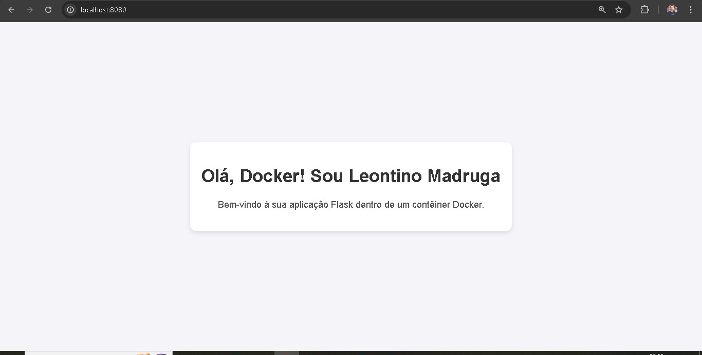

### 1 Criação do Projeto e da Aplicação Flask

O que foi feito: Criação de um diretório para o projeto e um arquivo Python contendo uma aplicação Flask básica, e um arquivo "requirements.txt".

Conteúdo do arquivo requirements.txt:

```python
    Flask==2.0.3
    Werkzeug==2.0.3
```

Conteúdo do arquivo app.py:

```python

from flask import Flask, render_template_string

app = Flask(__name__)

@app.route('/')
def home():
    html_content = """
    <!DOCTYPE html>
    <html lang="pt-BR">
    <head>
        <meta charset="UTF-8">
        <meta name="viewport" content="width=device-width, initial-scale=1.0">
        <title>Bem-vindo ao Docker!</title>
        <style>
            body {
                font-family: Arial, sans-serif;
                background-color: #f4f4f9;
                margin: 0;
                padding: 0;
                display: flex;
                justify-content: center;
                align-items: center;
                height: 100vh;
            }
            .container {
                text-align: center;
                background-color: #fff;
                padding: 20px;
                box-shadow: 0 4px 8px rgba(0, 0, 0, 0.1);
                border-radius: 10px;
            }
            h1 {
                color: #333;
            }
            p {
                color: #555;
            }
        </style>
    </head>
    <body>
        <div class="container">
            <h1>Olá, Docker!</h1>
            <p>Bem-vindo à sua aplicação Flask dentro de um contêiner Docker.</p>
        </div>
    </body>
    </html>
    """
    return render_template_string(html_content)

if __name__ == '__main__':
    app.run(host='0.0.0.0', port=8080)


```

Explicação: Criei uma aplicação mais rebuscada, Essa função home() serve uma página HTML simples que exibe uma mensagem de boas-vindas para um usuário que acessa a aplicação Flask, informando que a aplicação está rodando dentro de um contêiner Docker.

### 2 Criação do Dockerfile

Criação do arquivo chamado Dockerfile no diretório do projeto

Adição de instruções no Dockerfile para construir a imagem Docker.

Explicação: Cada linha no Dockerfile representa uma etapa na construção da imagem.

Conteúdo do Dockerfile:

```docker
FROM python:3.9-slim

WORKDIR /app

COPY . .

RUN pip install --no-cache-dir -r requirements.txt

EXPOSE 8080

CMD ["python", "app.py"]

```

Explicação das instruções:

\- **_FROM:_** Especifica a imagem base (Python 3.9 slim neste caso).

\- **_WORKDIR:_** Define o diretório de trabalho dentro do contêiner.

\- **_COPY:_** Copia arquivos do host para o contêiner.

\- **_RUN:_** Executa comandos durante a construção da imagem.

\- **_EXPOSE:_** Informa qual porta o contêiner vai escutar.

\- **_CMD:_** Define o comando padrão a ser executado quando o contêiner for iniciado.

### 3 Construção da Imagem Docker

Construção da imagem Docker a partir do Dockerfile.

Este passo cria uma imagem Docker baseada nas instruções do Dockerfile.

Comando utilizado:

    docker build -t flask-docker-leontino -f Dockerfile .

**_docker build:_** Comando para construir uma imagem Docker.

**_\-t flask-docker-app_**: Atribui um nome (tag) à imagem.

**_\-f DockerFile_** : Indica que o Dockerfile está no diretório atual.

### 4 Execução do Contêiner

O que foi feito: Execução de um contêiner a partir da imagem construída.

Explicação: Este passo cria e inicia um contêiner baseado na imagem que  
construímos.

Comando utilizado:

    docker run -d -p 8080:8080 flask-docker-leontino

**_docker run_**: Comando para executar um contêiner.

**_\-p 8080:8080_**: Mapeia a porta 8080 do contêiner para a porta 8080 do host.

**_flask-docker-leontino_**: Nome da imagem a ser executada.

## **_Screenshot :_**

**_![][imagem]_**


